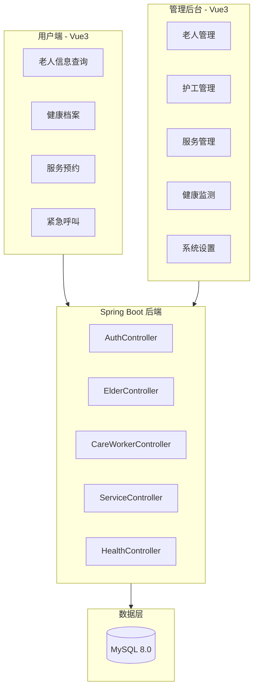
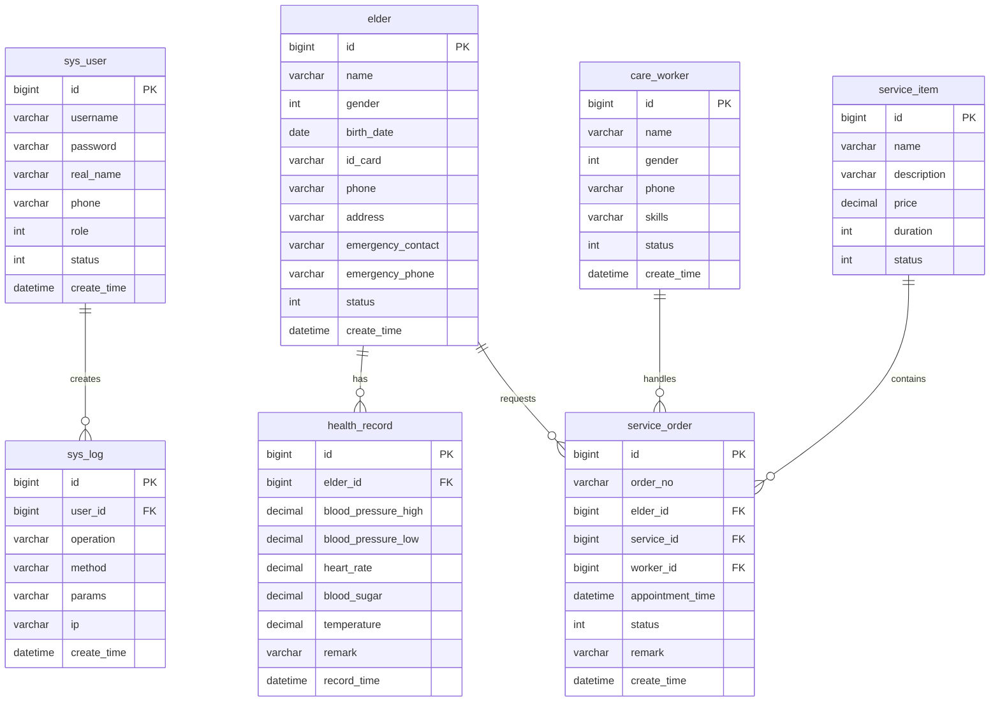

# 智慧养老系统 - 项目设计文档

## 1. 系统架构

## 2. ER 图

## 3. 接口清单

### AuthController - 认证模块
| 方法 | 路径 | 描述 |
|------|------|------|
| POST | /api/auth/login | 用户登录 |
| POST | /api/auth/logout | 用户登出 |
| GET | /api/auth/info | 获取当前用户信息 |

### ElderController - 老人管理
| 方法 | 路径 | 描述 |
|------|------|------|
| GET | /api/elder/page | 分页查询老人 |
| GET | /api/elder/{id} | 获取老人详情 |
| POST | /api/elder | 新增老人 |
| PUT | /api/elder | 更新老人信息 |
| DELETE | /api/elder/{id} | 删除老人 |

### CareWorkerController - 护工管理
| 方法 | 路径 | 描述 |
|------|------|------|
| GET | /api/worker/page | 分页查询护工 |
| GET | /api/worker/{id} | 获取护工详情 |
| POST | /api/worker | 新增护工 |
| PUT | /api/worker | 更新护工信息 |
| DELETE | /api/worker/{id} | 删除护工 |

### ServiceController - 服务管理
| 方法 | 路径 | 描述 |
|------|------|------|
| GET | /api/service/page | 分页查询服务项目 |
| POST | /api/service | 新增服务项目 |
| PUT | /api/service | 更新服务项目 |
| DELETE | /api/service/{id} | 删除服务项目 |

### ServiceOrderController - 服务订单
| 方法 | 路径 | 描述 |
|------|------|------|
| GET | /api/order/page | 分页查询订单 |
| POST | /api/order | 创建订单 |
| PUT | /api/order/status | 更新订单状态 |

### HealthController - 健康管理
| 方法 | 路径 | 描述 |
|------|------|------|
| GET | /api/health/page | 分页查询健康记录 |
| GET | /api/health/elder/{elderId} | 获取老人健康记录 |
| POST | /api/health | 新增健康记录 |

## 4. UI/UX 规范

### 色彩体系
- 主色调: `#409EFF` (蓝色，代表信任与专业)
- 成功色: `#67C23A`
- 警告色: `#E6A23C`
- 危险色: `#F56C6C`
- 背景色: `#F5F7FA`
- 卡片背景: `#FFFFFF`
- 文字主色: `#303133`
- 文字次色: `#909399`

### 字体规范
- 主字体: `-apple-system, BlinkMacSystemFont, 'Segoe UI', Roboto, 'Helvetica Neue', Arial, sans-serif`
- 标题字号: 20px / 18px / 16px
- 正文字号: 14px
- 辅助字号: 12px

### 间距规范
- 页面边距: 24px
- 卡片间距: 16px
- 元素间距: 8px / 12px / 16px

### 圆角规范
- 卡片圆角: 8px
- 按钮圆角: 4px
- 输入框圆角: 4px

### 阴影规范
- 卡片阴影: `0 2px 12px 0 rgba(0, 0, 0, 0.1)`
